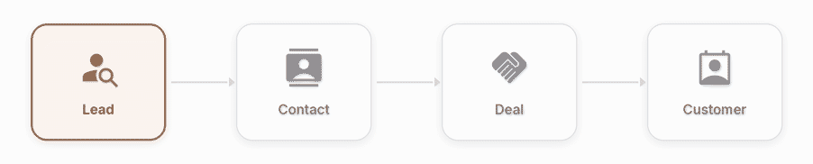
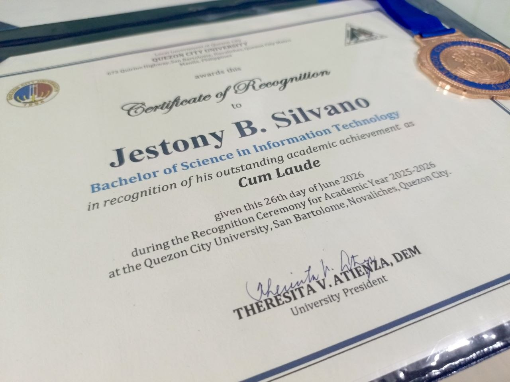

  
# Hi, I'm Jest

**Full-stack dev, building solutions to real-world problems with scalable and maintainable software.**

 

&nbsp;&nbsp;&nbsp;&nbsp;

 

## About Me

I'm a full-stack developer who likes building things that solve real problems. I work mostly with JavaScript, TypeScript, React, Node.js, and PostgreSQL, with a focus on writing software that's scalable and maintainable.

Currently building uniThread CRM and spending a lot of time learning backend architecture, system design, testing, and DSA.

---

## Tech Stack

### Frontend

### Backend

### Database & Backend Services

### DevOps / Deployments

**Currently strengthening:** Advanced TypeScript · Data Structures & Algorithms · Backend Architecture · API Design · CI/CD · Docker · System Design

---

## Featured Project: uniThread CRM

**uniThread CRM** is a multi-tenant SaaS CRM platform I've been building as a serious full-stack application. Organization-level data isolation and SaaS architecture are core parts of the system rather than additions to a simple CRUD application.

  

🔗 **Live:** [unithreadcrm.com](https://unithreadcrm.com/)

🔗 **Frontend:** [GitHub](https://github.com/06Jest/crm-project)

🔗 **Backend:** [GitHub](https://github.com/06Jest/CRM-PROJECT-BACKEND)

**Core workflow:** `Lead → Contact → Deal → Customer`

**What it includes:**

* Multi-tenancy with organization-level data isolation enforced through PostgreSQL Row Level Security
* Role-based access control with Owner, Manager, and Agent roles
* JWT authentication with refresh tokens and email verification
* Leads, contacts, deals, customers, activities, pipelines, tags, and statuses
* Internal messaging and real-time chat using Supabase Realtime
* Dashboard analytics and team leaderboards
* Invitations, subscription plans, and usage limits
* Simulated SMS, email, and call functionality for communication workflows
* Responsive UI across devices

**Stack:** React 18, TypeScript, Redux Toolkit, Material UI, Chart.js, Tiptap · Node.js, Express, TypeScript, Zod · PostgreSQL, Supabase, Row Level Security · Vercel, Railway

This project has been my hands-on lab for authentication, authorization, multi-tenant architecture, database design, API development, state management, real-time functionality, testing, and deployment.

---

## Engineering Experience

I care about building real applications rather than only following tutorials. I focus on understanding why systems work, writing maintainable code, and improving architecture over time.

Working on uniThread CRM has given me hands-on experience with:

* Authentication and session management
* Database migrations and schema evolution
* Multi-tenancy and Row Level Security policies
* Deployment configuration and environment variables
* CI/CD pipeline issues
* API error handling and validation edge cases
* Frontend and backend integration
* Real-time subscriptions
* State management
* DataGrid behavior and performance considerations
* Production debugging
* Git and GitHub workflows

Every one of these has been a practical lesson in how production systems actually behave, not just how they're supposed to work on paper.

---

## Currently Building / Learning

**Building**

* uniThread CRM
* Full-stack SaaS architecture
* Production-oriented APIs
* Multi-tenant systems
* Authentication and authorization systems

**Learning**

* Advanced TypeScript
* Data Structures & Algorithms
* System Design
* Testing with Jest, Playwright, and Supertest
* Docker and CI/CD
* Scalable application architecture
* Backend architecture and API design

---

## GitHub Statistics

  

    

  

---

## Education & Honors

**Bachelor of Science in Information Technology**  
Quezon City University · 2026

🏅 **Cum Laude**  
🎓 Academic achievement recognized for graduating with Latin honors

---

## Connect With Me 

The fastest way to reach me is by email. You can also connect with me on LinkedIn or X.
I'm always open to discussing software development, interesting projects, collaboration, and opportunities.

 &nbsp;&nbsp;&nbsp;&nbsp;&nbsp;&nbsp; 

